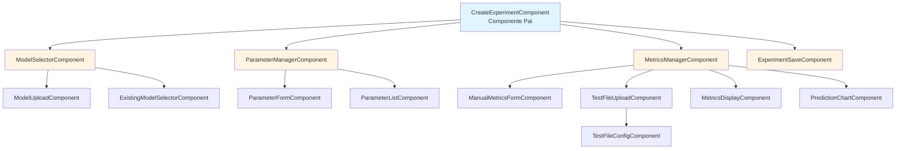
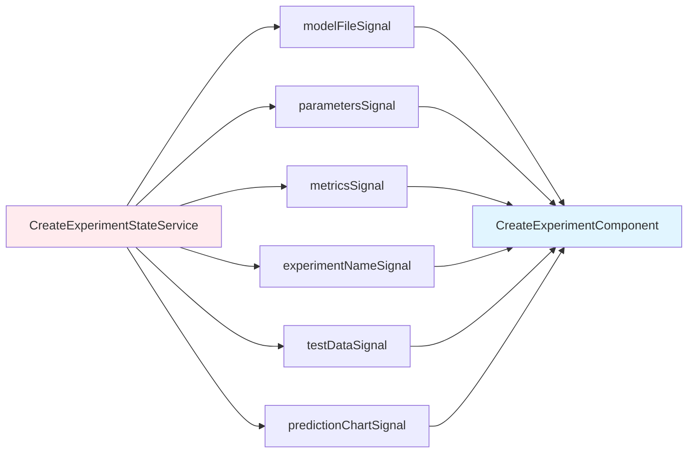
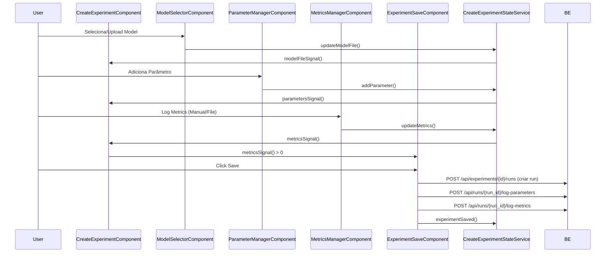
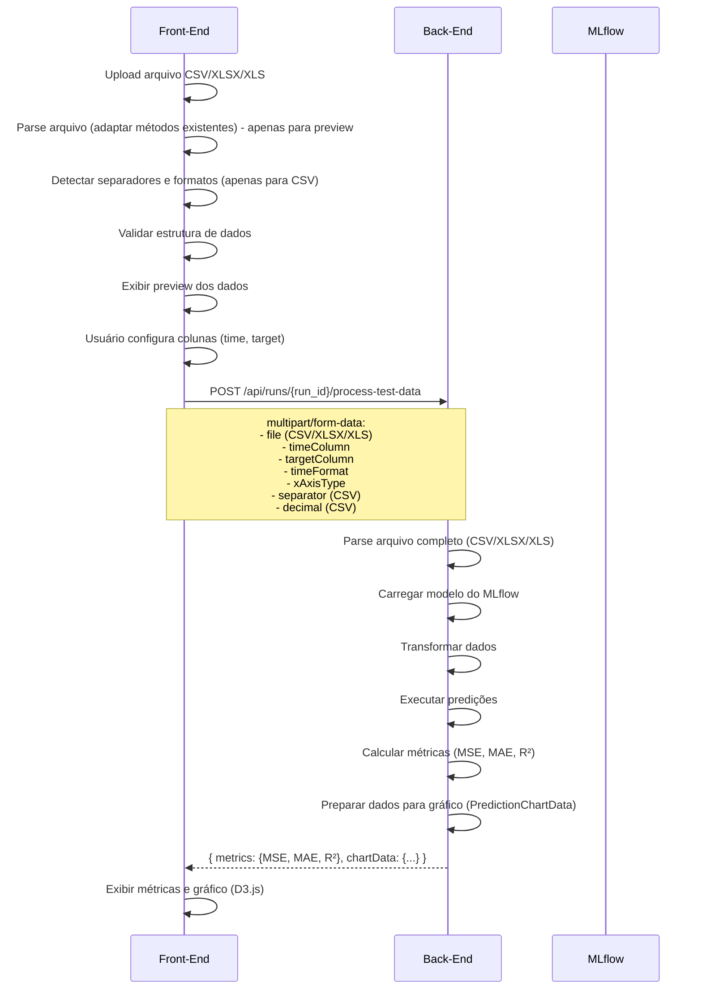
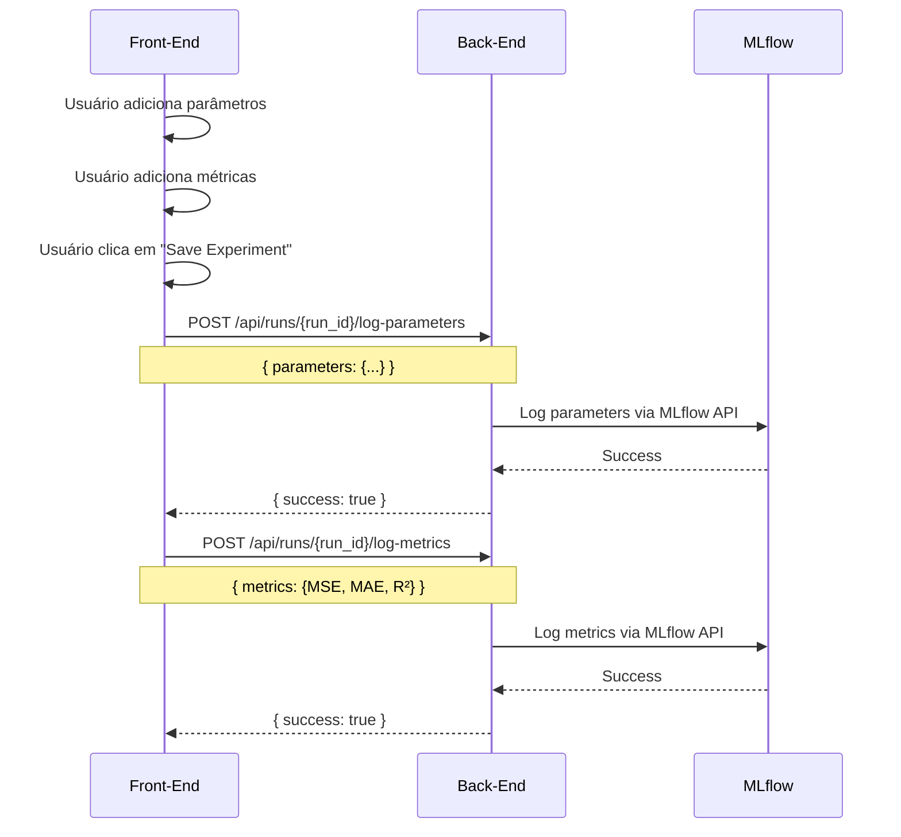
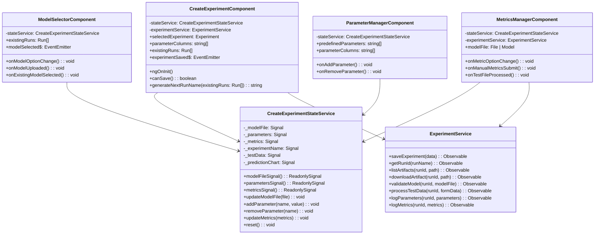
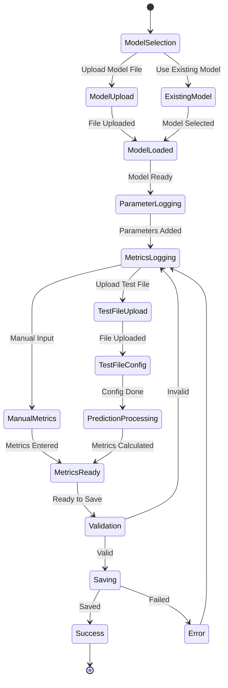

# Planejamento de Migração: Create New Experiment

## Visão Geral

Este documento apresenta o planejamento arquitetural para migração da aba **Create New Experiment** do Model Manager de Python (Streamlit) para Angular (TypeScript).
### Requisitos Técnicos
- PrimeNG para componentes UI
- Componentes com máximo de 200 linhas (aproximadamente)
- Comunicação via Signals entre componentes pais e filhos
- **D3.js** para visualização de dados (gráficos)
- Reutilizar `PredictionChartComponent` existente

---
## 1. ARQUITETURA DE COMPONENTES




## 2. ESTRUTURA DE SIGNALS

  



## 3. FLUXO DE DADOS

  



  

## 4. DETALHAMENTO DOS COMPONENTES

### **CreateExperimentComponent**

**Responsabilidades:**
- Orquestrar todos os sub-componentes
- Gerenciar estado geral do formulário
- Validar se pode salvar (métricas preenchidas)
- Gerar nome do experimento usando método `generateNextRunName()` (utiliza endpoint existente que retorna todas as runs)

**Inputs:**
- `selectedExperiment: Experiment` - Experimento selecionado
- `parameterColumns: string[]` - Colunas de parâmetros disponíveis
- `existingRuns: Run[]` - Runs existentes (para seleção de modelo)

**Outputs:**
- `experimentSaved: EventEmitter<Experiment>` - Emite quando experimento é salvo

**Signals utilizados:**
- `modelFileSignal()` - Arquivo/modelo carregado
- `parametersSignal()` - Parâmetros adicionados
- `metricsSignal()` - Métricas calculadas
- `experimentNameSignal()` - Nome gerado do experimento

---
### **ModelSelectorComponent**

**Responsabilidades:**
- Permitir escolha entre Upload ou Existing Model
- Gerenciar upload de arquivo .pkl
- Permitir seleção de modelo existente
- Exibir radio buttons para escolha do método

**Inputs:**
- `existingRuns: Run[]` - Lista de runs disponíveis

**Outputs:**
- `modelSelected: EventEmitter<File | Model>` - Emite modelo selecionado ou upado no componente fileUpload

**Componentes filhos:**
- `ModelUploadComponent`
- `ExistingModelSelectorComponent`

**Signals utilizados:**
- `modelFileSignal()` - Lê/escreve modelo selecionado

---
### **ModelUploadComponent**

**Responsabilidades:**
- Exibir componente de upload de arquivo (.pkl)
- Validar tipo de arquivo (apenas .pkl)
- Validar tamanho do arquivo (se necessário)
- Emitir evento quando arquivo for carregado
- Exibir feedback visual do upload

**Inputs:**
- Nenhum (usa fileUpload do PrimeNG diretamente)

**Outputs:**
- `fileUploaded: EventEmitter<File>` - Emite arquivo quando carregado

**Componentes PrimeNG:**
- `p-fileUpload` - Componente de upload

**Signals utilizados:**
- `modelFileSignal()` - Escreve arquivo carregado

---
### **ExistingModelSelectorComponent**

**Responsabilidades:**
- Exibir selectbox para escolher experimento existente
- Listar arquivos .pkl disponíveis no experimento selecionado
- Permitir seleção de arquivo .pkl específico
- Carregar modelo do experimento selecionado
- Exibir estado de carregamento
- Permitir reset da seleção

**Inputs:**
- `existingRuns: Run[]` - Lista de runs disponíveis

**Outputs:**
- `modelLoaded: EventEmitter<Model>` - Emite modelo quando carregado
- `resetRequested: EventEmitter<void>` - Emite quando reset é solicitado

**Componentes PrimeNG:**
- `p-select` - Seleção de experimento
- `p-select` - Seleção de arquivo .pkl
- `p-button` - Botão de carregar e reset

**Signals utilizados:**
- `modelFileSignal()` - Lê/escreve modelo carregado

**Dependências:**
- `ExperimentService` - Para buscar artifacts e download do modelo

---
### **ParameterManagerComponent**

**Responsabilidades:**
- Exibir formulário para adicionar parâmetros
  - Caso a opção "Other" (Outro) seja selecionada, um segundo formulário deve aparecer recebendo:
    - Nome do novo parâmetro
- Exibir lista de parâmetros adicionados
- Permitir remoção de parâmetros

**Inputs:**
- `predefinedParameters: string[]` - Parâmetros pré-definidos
- `parameterColumns: string[]` - Colunas de parâmetros do projeto

**Componentes filhos:**
- `ParameterFormComponent`
- `ParameterListComponent`

**Signals utilizados:**
- `parametersSignal()` - Lê/escreve parâmetros

---

### **MetricsManagerComponent**

**Responsabilidades:**
- Permitir escolha entre Manual Input ou Upload Test File
- Gerenciar formulário de métricas manuais
- Gerenciar upload e processamento de arquivo de teste
- Exibir métricas calculadas
- Exibir gráfico de predição (se aplicável)

**Inputs:**
- `modelFile: File | Model` - Modelo carregado (para predições)

**Componentes filhos:**
- `ManualMetricsFormComponent`
- `TestFileUploadComponent`
- `MetricsDisplayComponent`
- `PredictionChartComponent` (reutilizar existente)

**Signals utilizados:**
- `metricsSignal()` - Lê/escreve métricas
- `testDataSignal()` - Dados do arquivo de teste
- `predictionChartSignal()` - Dados do gráfico

---

### **TestFileUploadComponent**

**Responsabilidades:**
- Upload de arquivo CSV/XLSX/XLS
- **Parsing de arquivo CSV/XLSX/XLS** (adaptar métodos existentes de CSV para suportar também XLSX/XLS) - apenas para preview/validação inicial
- **Detecção automática de separadores e formatos** (adaptar métodos existentes) - apenas para preview
- **Validação de estrutura de dados** (adaptar métodos existentes) - apenas para preview
- Configuração de colunas (time, target)
- Configuração de formato de data
- Envio de arquivo para backend via multipart/form-data para processamento e predição

**Inputs:**
- `modelFile: File | Model` - Modelo para predição
- `runId: string` - ID do run para processamento

**Componentes filhos:**
- `TestFileConfigComponent`  - Configuração de colunas e formato

**Signals utilizados:**
- `testDataSignal()` - Lê/escreve dados do teste (apenas para preview)
- `metricsSignal()` - Escreve métricas calculadas (recebidas do backend)
- `predictionChartSignal()` - Escreve dados do gráfico (recebidos do backend)

**Nota:**
- Arquivo é enviado diretamente ao backend via multipart/form-data (não parseado para envio)
- Parsing no front-end é apenas para preview e validação inicial (todos os tipos: CSV, XLSX, XLS)
- Backend faz parsing completo e processamento
- **Tarefa**: Adaptar métodos existentes de parsing de CSV para também suportar XLSX e XLS

---

### **ExperimentSaveComponent**

**Responsabilidades:**
- Exibir botão de salvar
- Validar se pode salvar (métricas preenchidas)
- Chamar serviço para salvar experimento

**Inputs:**
- `experimentName: string` - Nome do experimento
- `canSave: boolean` - Se pode salvar (métricas preenchidas)

**Outputs:**
- `saveClicked: EventEmitter<void>` - Emite quando salvar é clicado

**Signals utilizados:**
- `metricsSignal()` - Lê para validar
- `modelFileSignal()` - Lê modelo
- `parametersSignal()` - Lê parâmetros

---

## 5. INTERFACES/MODELS NECESSÁRIOS

```typescript

  

interface Experiment {

  

  id: string;

  

  name: string;

  

  description?: string;

  

}

  

  

interface Run {

  

  id: string;

  

  name: string;

  

  experimentId: string;

  

}

  

  

interface Parameter {

  

  name: string;

  

  value: string | number | boolean | object;

  

}

  

  

interface Metrics {

  

  MSE: number;

  

  MAE: number;

  

  R2: number;

  

}

  

  

interface TestFileConfig {

  

  timeColumn?: string;

  

  targetColumn: string;

  

  timeFormat?: string;

  

  xAxisType: 'Time' | 'Index';

  

}

  

  

interface PredictionChartData {

  

  x: (string | number)[];

  

  yTrue: number[];

  

  yPredicted: number[];

  

  xTitle: string;

  

}

  

interface ValidateModelResponse {

  

  valid: boolean;

  

  message?: string;

  

  requiredColumns?: string[];

  

}

  

interface ProcessTestDataRequest {

  

  file: File;

  

  timeColumn?: string;

  

  targetColumn: string;

  

  timeFormat?: string;

  

  xAxisType: 'Time' | 'Index';

  

  separator?: string;

  

  decimal?: string;

  

}

  

interface ProcessTestDataResponse {

  

  metrics: Metrics;

  

  chartData: PredictionChartData;

  

}

  

```

  

---

## 5.1 Verificação: MLflow REST API

**Decisão necessária:** Verificar se é possível chamar MLflow REST API diretamente do front-end ou se precisa de proxy no back-end.
### Opção 1: Chamada Direta do Front-End

**Vantagens:**
- Menos carga no back-end
- Menos latência (uma chamada a menos)

**Endpoints MLflow REST API relevantes:**
- `POST /api/2.0/mlflow/runs/log-parameter` - Loggar parâmetro
- `POST /api/2.0/mlflow/runs/log-metric` - Loggar métrica
- `POST /api/2.0/mlflow/runs/log-batch` - Loggar múltiplos parâmetros/métricas de uma vez

### Opção 2: Proxy no Back-End 

**Vantagens:**
- **Segurança**: Credenciais e URL do MLflow ficam no back-end
- **Sem problemas de CORS**: Back-end faz a chamada
- **Controle centralizado**: Mais fácil gerenciar autenticação e configurações
- **Flexibilidade**: Pode adicionar lógica adicional (validação, transformação)

**Desvantagens:**
- Mais uma camada (front-end → back-end → MLflow)
- Back-end precisa implementar endpoints proxy

---

## 6. SERVIÇOS DE ESTADO

### CreateExperimentStateService

  

```typescript

  

@Injectable({ providedIn: 'root' })

  

export class CreateExperimentStateService {

  

  // Signals

  

  private _modelFile = signal<File | Model | null>(null);

  

  private _parameters = signal<Record<string, any>>({});

  

  private _metrics = signal<Metrics | null>(null);

  

  private _experimentName = signal<string>('');

  

  private _testData = signal<any>(null);

  

  private _predictionChart = signal<PredictionChartData | null>(null);

  

  // Computed signals

  

  canSave = computed(() => this._metrics() !== null);

  

  // Getters

  

  modelFileSignal = this._modelFile.asReadonly();

  

  parametersSignal = this._parameters.asReadonly();

  

  metricsSignal = this._metrics.asReadonly();

  

  experimentNameSignal = this._experimentName.asReadonly();

  

  testDataSignal = this._testData.asReadonly();

  

  predictionChartSignal = this._predictionChart.asReadonly();

  

  // Methods

  

  updateModelFile(file: File | Model): void;

  

  addParameter(name: string, value: any): void;

  

  removeParameter(name: string): void;

  

  updateMetrics(metrics: Metrics): void;

  

  updateExperimentName(name: string): void;

  

  generateNextRunName(experimentId: string, existingRuns: Run[]): string;

  

  reset(): void;

  

}

  

```

  

---

## 7. SERVIÇOS DE API
### ExperimentService (Métodos relevantes)

  

```typescript

  

@Injectable({ providedIn: 'root' })

  

export class ExperimentService {

  

  // Métodos existentes (não precisam ser implementados)

  saveExperiment(data: SaveExperimentData): Observable<Experiment>;

  

  getRunId(runName: string): Observable<string>;

  

  listArtifacts(runId: string, path?: string): Observable<Artifact[]>;

  

  downloadArtifact(runId: string, path: string): Observable<Blob>;

  

  // Métodos novos necessários

  validateModel(runId: string, modelFile: File): Observable<ValidateModelResponse>;

  

  processTestData(runId: string, formData: FormData): Observable<ProcessTestDataResponse>;

  

  logParameters(runId: string, parameters: Record<string, any>): Observable<{ success: boolean }>;

  

  logMetrics(runId: string, metrics: Metrics): Observable<{ success: boolean }>;

  

}

  

```

  

---

## 8. RESPONSABILIDADES: FRONT-END vs BACK-END
### 8.1 Front-End (Angular)

**Responsabilidades:**
- Interface do usuário e interação
- Validação de formulários e inputs
- Gerenciamento de estado (signals)
- Renderização de componentes visuais
- **Parsing de arquivos CSV/XLSX/XLS** (adaptar métodos existentes de CSV para suportar também XLSX/XLS) - apenas para preview/validação inicial
- **Detecção automática de separadores e formatos** (adaptar métodos existentes) - apenas para preview
- **Validação de estrutura de dados** (adaptar métodos existentes) - apenas para preview
- **Geração de nome de experimento** (usando endpoint existente que retorna todas as runs)
- Upload de arquivos via multipart/form-data (envio direto ao backend)
- Exibição de dados e gráficos usando **D3.js**
- Reutilizar `PredictionChartComponent` existente
- Navegação e roteamento
- Formatação de dados para exibição
- Chamadas para logging de parâmetros e métricas (via endpoints proxy do backend)
### 8.2 Back-End (Python)

**Responsabilidades:**
1. **Processamento de Arquivo de Teste:**
   - Recebimento de arquivo via multipart/form-data (CSV, XLSX ou XLS)
   - Parsing completo do arquivo no backend
   - Conversão de tipos de dados
   - Tratamento de valores faltantes (NaN)

2. **Transformação de Dados:**
   - Aplicação de transformações do modelo (scalers, encoders, etc.)
   - Preparação de dados para predição
   - Alinhamento de índices e colunas

3. **Predição:**
   - Carregamento do modelo (.pkl)
   - Execução de predições em lote
   - Tratamento de modelos ensemble (seleção de coluna de predição)
   - Formatação de resultados (array, Series, DataFrame)

4. **Cálculo de Métricas:**
   - Cálculo de MSE (Mean Squared Error)
   - Cálculo de MAE (Mean Absolute Error)
   - Cálculo de R² (R-squared)
   - Arredondamento apropriado

5. **Geração de Dados para Gráfico:**
   - Preparação de dados para visualização (real vs predicted)
   - Formatação de índices temporais
   - Estruturação de dados no formato esperado pelo componente PredictionChart (D3.js)

6. **Validação de Modelo:**
   - Validação de arquivo .pkl (formato, estrutura)
   - Validação de compatibilidade de dados com modelo
   - Verificação de colunas necessárias

7. **Gerenciamento de Experimentos:**
   - Criação de novos experimentos no MLflow (endpoint já existe)
   - **Logging de parâmetros no MLflow** (novo endpoint necessário)
   - **Logging de métricas no MLflow** (novo endpoint necessário)
   - Logging de modelos (via endpoint existente)
   - Download de artifacts (.pkl files)

### 8.3 Endpoints Back-End Necessários

  

```typescript

// Endpoints necessários no backend Python

  

POST /api/runs/{run_id}/validate-model

// Valida arquivo de modelo (.pkl)

Body: multipart/form-data com arquivo .pkl

Response: {

  valid: boolean,

  message?: string,

  requiredColumns?: string[]

}

  

POST /api/runs/{run_id}/process-test-data

// Processa dados de teste (arquivo enviado diretamente)

Body: multipart/form-data com:

  - file: File (CSV, XLSX ou XLS)

  - timeColumn?: string

  - targetColumn: string

  - timeFormat?: string

  - xAxisType: 'Time' | 'Index'

  - separator?: string (para CSV)

  - decimal?: string (para CSV)

Response: {

  metrics: Metrics,

  chartData: PredictionChartData

}

  

POST /api/runs/{run_id}/log-parameters

// Logga parâmetros no MLflow

Body: {

  parameters: Record<string, string | number | boolean>

}

Response: { success: boolean }

  

POST /api/runs/{run_id}/log-metrics

// Logga métricas no MLflow

Body: {

  metrics: Metrics

}

Response: { success: boolean }

```

  

**Nota sobre geração de nome de experimento:**
- A geração do próximo nome disponível para run pode ser feita no **front-end**
- Utilizar endpoint existente que retorna todas as runs do projeto
- Implementar lógica de geração de nome no `CreateExperimentComponent`

**Nota sobre criação de experimento:**
- O endpoint `POST /api/experiments/{experiment_id}/runs` **já existe** e não precisa ser implementado
- Utilizar endpoint existente para criar o run inicial

**Nota sobre MLflow REST API:**
- MLflow possui REST API (ex: `POST /api/2.0/mlflow/runs/log-parameter`, `POST /api/2.0/mlflow/runs/log-metric`)
- **Verificar se é possível chamar diretamente do front-end** ou se precisa de proxy no back-end
- Considerações:
  - Autenticação (se MLflow requer autenticação)
  - CORS (Cross-Origin Resource Sharing)
  - Configuração de URL do MLflow server

**Endpoints já existentes (não precisam ser implementados):**

- `POST /api/experiments/{experiment_id}/runs` - Já existe, usar para criar novo experimento

### 8.4 Fluxo de Dados: Front-End → Back-End

**Exemplo: Upload Test File para Cálculo de Métricas**

  



  

**Nota sobre parsing no front-end:**
- Parsing no front-end é feito para **preview e validação inicial** apenas
- Suporta CSV, XLSX e XLS (após adaptar métodos existentes)
- Arquivo completo é enviado ao backend via multipart/form-data
- Backend faz parsing completo e processamento para garantir consistência

**Exemplo: Logging de Parâmetros e Métricas**

  



  

### 8.5 Notas Importantes

- **Cálculo de métricas**: Deve ser sempre feito no backend para garantir consistência e usar bibliotecas Python (sklearn)
- **Processamento de arquivos**: Todos os arquivos (CSV, XLSX, XLS) são enviados diretamente ao backend via multipart/form-data
  - Parsing no front-end (CSV/XLSX/XLS) é apenas para preview/validação inicial
  - **Tarefa**: Adaptar métodos existentes de parsing de CSV para também suportar XLSX e XLS no front-end
  - Backend faz parsing completo e processamento
- **Envio de arquivos**: Usar multipart/form-data para eficiência (arquivos podem ultrapassar 10MB)
- **Predições**: Modelos Python (.pkl) devem ser executados no backend, não no front-end
- **Transformações**: Transformações de dados (scalers, encoders) devem ser aplicadas no backend
- **Validação de modelo**: Validação de arquivo .pkl e compatibilidade deve ser feita no backend
- **Gráficos**: Renderização usando **D3.js** no front-end. PredictionChart já implementado e reutilizável
- **Geração de nome de experimento**: Feita no front-end usando endpoint existente que retorna todas as runs
- **Criação de experimento**: Usar endpoint existente `POST /api/experiments/{experiment_id}/runs`
- **Logging no MLflow**: Implementar endpoints proxy no backend para logging de parâmetros e métricas

---

  

## 9. COMPONENTES PRIMENG UTILIZADOS

- `p-fileUpload` - Upload de arquivo .pkl
- `p-select` - Seleção de modelo existente e  seleção de formato de data
- `p-inputText` - Input de parâmetros
- `p-button` - Botões de ação
- `p-card` - Cards de seção
- `p-tabView` - Tabs (se necessário)
- `p-multiSelect` - Seleção múltipla
- **D3.js** - Biblioteca para visualização de dados (gráficos)
  - Reutilizar `PredictionChartComponent` existente

  

---

  

## 10. ESTRUTURA DE PASTAS

```

src/app/features/model-manager/

  

├── create-experiment/
│   ├── create-experiment.component.ts
│   ├── create-experiment.component.html
│   ├── create-experiment.component.scss
│   ├── components/
│   │   ├── model-selector/
│   │   │   ├── model-selector.component.ts
│   │   │   ├── model-upload/
│   │   │   └── existing-model-selector/
│   │   ├── parameter-manager/
│   │   │   ├── parameter-manager.component.ts
│   │   │   ├── parameter-form/
│   │   │   └── parameter-list/
│   │   ├── metrics-manager/
│   │   │   ├── metrics-manager.component.ts
│   │   │   ├── manual-metrics-form/
│   │   │   ├── test-file-upload/
│   │   │   │   └── test-file-config/
│   │   │   ├── metrics-display/
│   │   │   └── prediction-chart/ (reutilizar existente)
│   │   └── experiment-save/
└── @service/
  └── model-manager
    └── experiment.service.ts
    └── create-experiment-state.service.ts
└── @model/
  └── model-manager
    └── experiment.models.ts
    └── create-experiment.models.ts
```

  

---

  

## 11. CHECKLIST DE IMPLEMENTAÇÃO

### Front-End (Angular)
- [ ] Criar CreateExperimentComponent (pai)
- [ ] Criar CreateExperimentStateService
- [ ] Implementar método `generateNextRunName()` no CreateExperimentStateService
  - Utilizar endpoint existente que retorna todas as runs
  - Implementar lógica de geração de nome sequencial
- [ ] Implementar ModelSelectorComponent
- [ ] Implementar ModelUploadComponent
- [ ] Implementar ExistingModelSelectorComponent
- [ ] Implementar ParameterManagerComponent
- [ ] Implementar MetricsManagerComponent
- [ ] Implementar TestFileUploadComponent
- [ ] Adaptar métodos existentes de parsing de CSV para suportar também XLSX e XLS
  - Adicionar suporte para leitura de arquivos Excel (usando biblioteca como xlsx ou similar)
  - Manter compatibilidade com métodos existentes de CSV
  - Garantir que detecção de separadores e validação funcionem para todos os tipos
- [ ] Reutilizar PredictionChartComponent existente (D3.js)
- [ ] Implementar ExperimentSaveComponent
- [ ] Integrar com ExperimentService
- [ ] Implementar chamadas para logging de parâmetros e métricas
- [ ] Testes unitários
- [ ] Testes E2E / integração

### Back-End (Python)

#### Endpoints API
- [ ] `POST /api/runs/{run_id}/validate-model`
  - Implementar recebimento de arquivo .pkl via multipart/form-data
  - Implementar validação de arquivo .pkl (formato, estrutura)
  - Implementar validação de compatibilidade de dados com modelo
  - Implementar verificação de colunas necessárias
  - Retornar resultado da validação

- [ ] `POST /api/runs/{run_id}/process-test-data`
  - Implementar recebimento de arquivo via multipart/form-data (CSV, XLSX ou XLS)
  - Implementar parsing completo do arquivo no backend
  - Implementar recebimento de parâmetros (timeColumn, targetColumn, timeFormat, xAxisType, separator, decimal)
  - Implementar carregamento de modelo do MLflow
  - Implementar transformação de dados (scalers, encoders)
  - Implementar execução de predições em lote
  - Implementar tratamento de modelos ensemble (seleção de coluna de predição)
  - Implementar cálculo de métricas (MSE, MAE, R²)
  - Implementar preparação de dados para gráfico (formato PredictionChartData)
  - Implementar formatação de índices temporais
  - Retornar métricas e chartData

- [ ] `POST /api/runs/{run_id}/log-parameters`
  - Implementar proxy para MLflow REST API ou integração direta
  - Implementar logging de parâmetros no MLflow
  - Implementar tratamento de erros
  - Retornar status de sucesso/falha

- [ ] `POST /api/runs/{run_id}/log-metrics`
  - Implementar proxy para MLflow REST API ou integração direta
  - Implementar logging de métricas no MLflow
  - Implementar tratamento de erros
  - Retornar status de sucesso/falha

#### Métodos Auxiliares

- [ ] Implementar processamento de arquivos (CSV, XLSX, XLS)
  - Parsing de arquivos CSV (com suporte a diferentes separadores)
  - Parsing de arquivos Excel (XLSX, XLS)
  - Conversão de tipos de dados
  - Tratamento de valores faltantes (NaN)
  - Detecção automática de separadores (para CSV)


- [ ] Implementar transformação de dados
  - Aplicação de transformações do modelo (scalers, encoders)
  - Preparação de dados para predição
  - Alinhamento de índices e colunas


- [ ] Implementar sistema de predição
  - Carregamento de modelos .pkl do MLflow
  - Execução de predições em lote
  - Tratamento especial para modelos ensemble
  - Formatação de resultados (array, Series, DataFrame)

- [ ] Implementar cálculo de métricas
  - Cálculo de MSE usando sklearn
  - Cálculo de MAE usando sklearn
  - Cálculo de R² usando sklearn
  - Arredondamento apropriado

- [ ] Implementar geração de dados para gráfico
  - Preparação de dados real vs predicted
  - Formatação de índices temporais
  - Estruturação no formato PredictionChartData

- [ ] Implementar validação de modelos
  - Validação de formato .pkl
  - Validação de estrutura do modelo
  - Verificação de compatibilidade

- [ ] Implementar integração com MLflow REST API
  - Verificar se é possível chamar diretamente do front-end ou precisa de proxy
  - Implementar proxy/endpoints para logging de parâmetros
  - Implementar proxy/endpoints para logging de métricas
  - Implementar tratamento de autenticação (se necessário)
  - Implementar tratamento de CORS (se necessário)
  - Configuração de URL do MLflow server

---

## 12. DIAGRAMAS DE CLASSES


### 12.1 Create Experiment - Diagrama de Classes

  



  

### 12.2 Fluxo Completo - Create Experiment

  



  

---

  

## 13. NOTAS FINAIS

- Todos os componentes devem ser standalone (Angular 17+)
- Usar OnPush change detection para performance
- Documentar interfaces e métodos públicos
- Seguir padrões de código do projeto existente
- Considerar internacionalização (i18n) se aplicável
- Implementar loading states em todas as operações assíncronas
- Adicionar tratamento de erros robusto
- Reutilizar métodos existentes para parsing de CSV
- Reutilizar PredictionChartComponent existente (D3.js)
