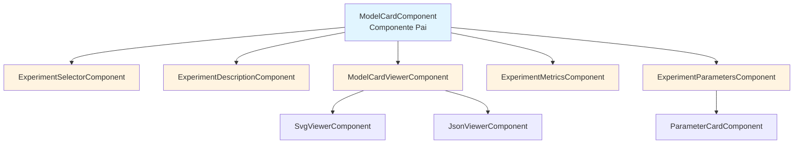
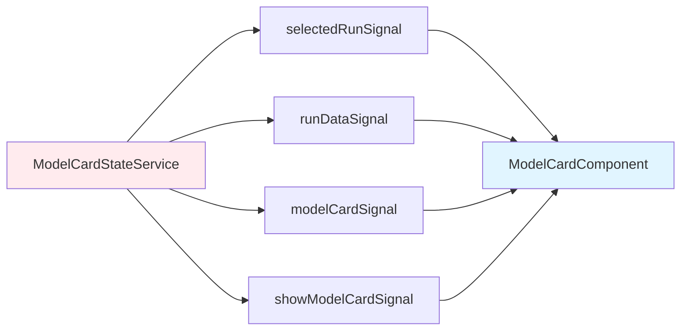
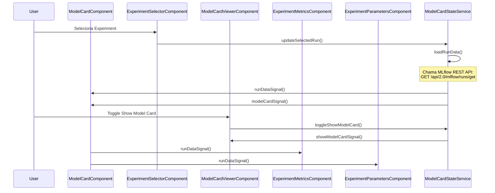
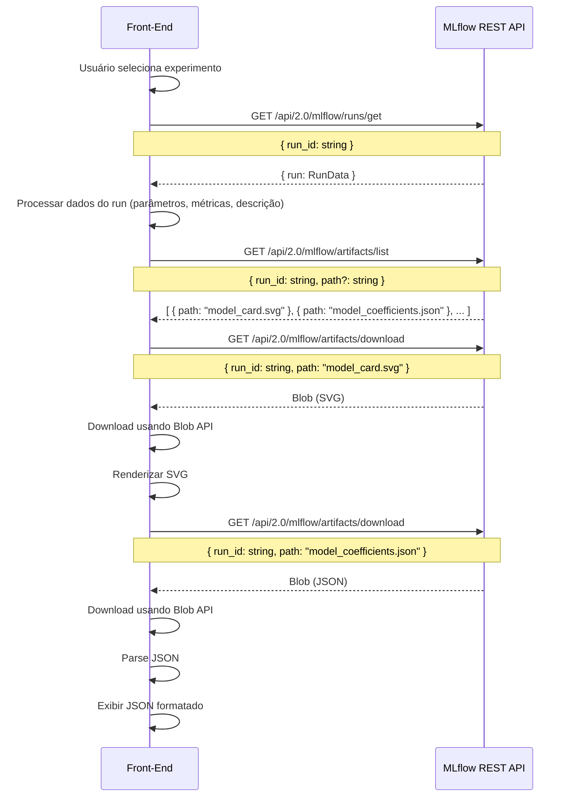
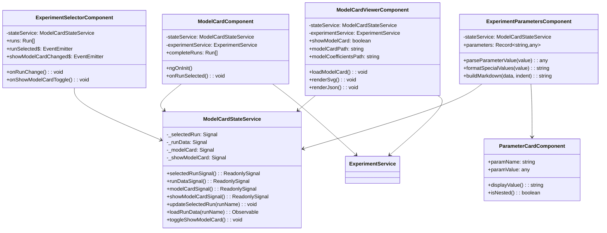
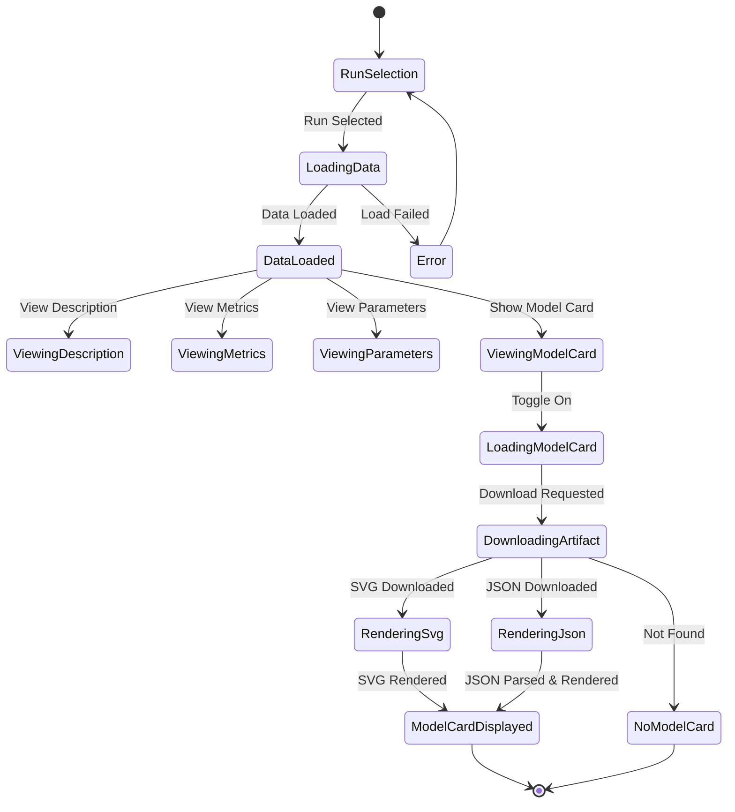

# Planejamento de Migração: Model Card

  

## Visão Geral

  

Este documento apresenta o planejamento arquitetural para migração da aba **Model Card** (View Experiment Card) do Model Manager de Python (Streamlit) para Angular (TypeScript).

  

### Requisitos Técnicos

- PrimeNG para componentes UI

- Componentes com máximo de 200 linhas (aproximadamente)

- Comunicação via Signals entre componentes pais e filhos

- **Download de artifacts** usando Blob API no front-end

- **Parsing de JSON** no front-end (talvez possa ser alterado durante implementação)

  

---

## 1. ARQUITETURA DE COMPONENTES

  



  

## 2. ESTRUTURA DE SIGNALS

  



  

## 3. FLUXO DE DADOS

  



  

## 4. DETALHAMENTO DOS COMPONENTES

  

### **ModelCardComponent** (Pai)

  

**Responsabilidades:**

- Orquestrar todos os sub-componentes

- Carregar dados do experimento selecionado

- Gerenciar layout (grid de parâmetros)

  

**Inputs:**

- `completeRuns: Run[]` - Lista completa de runs disponíveis

  

**Signals utilizados:**

- `selectedRunSignal()` - Run selecionado

- `runDataSignal()` - Dados do run

- `modelCardSignal()` - Model card (SVG ou JSON)

- `showModelCardSignal()` - Se deve mostrar model card

  

---

### **ExperimentSelectorComponent**

  

**Responsabilidades:**

- Exibir selectbox para escolher experimento

- Exibir checkbox para mostrar/ocultar Model Card

  

**Inputs:**

- `runs: Run[]` - Lista de runs disponíveis

  

**Outputs:**

- `runSelected: EventEmitter<string>` - Emite run selecionado

- `showModelCardChanged: EventEmitter<boolean>` - Emite mudança no checkbox

  

**Signals utilizados:**

- `selectedRunSignal()` - Lê/escreve run selecionado

- `showModelCardSignal()` - Lê/escreve estado do checkbox

  

---

### **ExperimentDescriptionComponent**

  

**Responsabilidades:**

- Exibir descrição do experimento em um expander

  

**Inputs:**

- `description: string | null` - Descrição do experimento

  

**Signals utilizados:**

- `runDataSignal()` - Lê descrição do run

  

---

### **ModelCardViewerComponent**

  

**Responsabilidades:**

- Exibir Model Card (SVG ou JSON) dentro de um p-card

- **Download de artifacts** usando Blob API

- **Parsing de JSON** (model_coefficients.json)

- Gerenciar renderização do SVG/JSON

- Coordenar exibição baseada no tipo de artifact

  

**Inputs:**

- `showModelCard: boolean` - Se deve mostrar

- `modelCardPath: string | null` - Caminho do model card

- `modelCoefficientsPath: string | null` - Caminho dos coeficientes

  

**Componentes filhos:**

- `SvgViewerComponent` - Visualizador SVG (com ou sem interação)

- `JsonViewerComponent`  - Visualizador JSON

  

**Componentes PrimeNG:**

- `p-card` - Container para o model card

  

**Signals utilizados:**

- `modelCardSignal()` - Lê dados do model card

- `showModelCardSignal()` - Lê se deve mostrar

  

**Nota sobre Panzoom vs p-card:**

- O `p-card` é usado como **container visual** do Model Card (estrutura, estilo, layout)

- Para SVGs grandes que precisam de navegação (zoom/pan), pode-se usar:

  - **Opção 1**: Biblioteca panzoom para interatividade (recomendado para SVGs complexos/grandes)

  - **Opção 2**: CSS overflow com scroll (mais simples, adequado para SVGs médios)

  - **Opção 3**: Usar apenas p-card sem interação adicional (se o SVG for pequeno o suficiente)

- A decisão deve ser baseada no tamanho e complexidade dos SVGs gerados pelo back-end

  

- **Recomendação**: Começar com CSS scroll simples e adicionar panzoom apenas se necessário

  

---

### **SvgViewerComponent**

  

**Responsabilidades:**

- Renderizar SVG em container seguro

- Aplicar interação (panzoom ou scroll) se necessário

- Gerenciar zoom e pan (se panzoom for usado)

  

**Inputs:**

- `svgContent: string` - Conteúdo SVG

- `height: number` - Altura do container

- `enablePanzoom: boolean` - Se deve habilitar panzoom (opcional, default: false)

  

**Tecnologias:**

- Panzoom library (via CDN ou npm) - **Opcional**, apenas se necessário para SVGs grandes

- Angular DomSanitizer para SVG (obrigatório para segurança)

- CSS overflow para scroll simples (alternativa ao panzoom)

  

**Componentes PrimeNG:**

- `p-card` - Container do SVG (se necessário para estrutura visual)

  

---

### **JsonViewerComponent**

  

**Responsabilidades:

- Renderizar JSON de forma legível

- **Parsing de JSON** recebido do backend

- Formatação de dados para exibição

  

**Inputs:**

- `jsonContent: string | object` - Conteúdo JSON

  

**Componentes PrimeNG:**

- `p-card` - Container do JSON

  

---

  

### **ExperimentMetricsComponent**

  

**Responsabilidades:**

- Exibir métricas do experimento (MSE, MAE, R2)

- Formatar valores

  

**Inputs:**

- `metrics: Metrics` - Métricas do experimento

  

**Signals utilizados:**

- `runDataSignal()` - Lê métricas do run

  

**Componentes PrimeNG:**

- `p-card` para container

- `p-divider` para separadores

  

---

### **ExperimentParametersComponent**

  

**Responsabilidades:**

- Exibir parâmetros em grid (4 colunas para tamanho de tela padrão, 2 para tablet, 1 para mobile e 6 - 8 para telas mais largas, usando propriedades do primeflex)

- **Processar dados aninhados** (dict, list) - parsing no front-end

- **Formatar valores especiais** (NaN, Infinity)

- Renderizar markdown para estruturas aninhadas

  

**Inputs:**

- `parameters: Record<string, any>` - Parâmetros do experimento

  

**Componentes filhos:**

- `ParameterCardComponent` - Card individual de parâmetro

  

**Signals utilizados:**

- `runDataSignal()` - Lê parâmetros do run

---

### **ParameterCardComponent**

  

**Responsabilidades:**

- Exibir um parâmetro individual

- **Processar valor** (string, number, object, array) - parsing no front-end

- Renderizar markdown para estruturas aninhadas

- Tratar valores especiais (NaN, Infinity, -Infinity) ou ausência de valor

  

**Inputs:**

- `paramName: string` - Nome do parâmetro

- `paramValue: any` - Valor do parâmetro

  

**Métodos auxiliares:**

- `parseParameterValue(value: string): any` - Parse de string para objeto

- `formatSpecialValues(value: any): string` - Formata valores especiais

- `buildMarkdown(data: any, indent: number): string` - Gera markdown aninhado

  

---

## 5. INTERFACES/MODELS NECESSÁRIOS

  

```typescript

  

interface Run -> Já existe

  

interface ModelCardArtifact {

  path: string;

  type: 'svg' | 'json';

  content?: string;

}

  

interface Metrics {

  MSE: number;

  MAE: number;

  R2: number;

}

  

```

  

---

  

## 6. SERVIÇOS DE ESTADO

  

### ModelCardStateService

  

```typescript

  

@Injectable({ providedIn: 'root' })

  

export class ModelCardStateService {

  

  // Signals

  private _selectedRun = signal<string | null>(null);

  private _runData = signal<RunData | null>(null);

  private _modelCard = signal<ModelCardArtifact | null>(null);

  private _showModelCard = signal<boolean>(false);

  

  // Getters

  selectedRunSignal = this._selectedRun.asReadonly();

  runDataSignal = this._runData.asReadonly();

  modelCardSignal = this._modelCard.asReadonly();

  showModelCardSignal = this._showModelCard.asReadonly();

  

  // Methods

  updateSelectedRun(runName: string): void;

  loadRunData(runId: string): Observable<RunData>;

  

  // Chama MLflow REST API: GET /api/2.0/mlflow/runs/get

  

  // Processa resposta para extrair parâmetros, métricas e descrição

  toggleShowModelCard(): void;

  reset(): void;

  

}

  

```

  

---

  

## 7. SERVIÇOS DE API

  

### ExperimentService (Métodos relevantes)

  

```typescript

  

@Injectable({ providedIn: 'root' })

  

export class ExperimentService {

  

  // Métodos existentes (já implementados)

  getRunId(runName: string): Observable<string>;

  

  // Métodos novos - chamadas diretas ao MLflow REST API

  getRunData(runId: string): Observable<RunData>;

  // Implementa: GET /api/2.0/mlflow/runs/get

  // Verificar se precisa de proxy no backend ou pode chamar diretamente

  

  listArtifacts(runId: string, path?: string): Observable<Artifact[]>;

  // Implementa: GET /api/2.0/mlflow/artifacts/list

  // Chamada direta ao MLflow REST API

  

  downloadArtifact(runId: string, path: string): Observable<Blob>;

  // Implementa: GET /api/2.0/mlflow/artifacts/download

  // Chamada direta ao MLflow REST API

  

}

  

```

  

---

  

## 7.1 Verificação: MLflow REST API

  

**Decisão necessária:** Verificar se é possível chamar MLflow REST API diretamente do front-end ou se precisa de proxy no back-end.

  

### Opção 1: Chamada Direta do Front-End

  

**Vantagens:**

- Menos carga no back-end

- Menos latência (uma chamada a menos)

  

**Desvantagens/Considerações:**

- **CORS**: MLflow server precisa permitir CORS do domínio do front-end

- **Autenticação**: Se MLflow requer autenticação, precisa ser gerenciada no front-end

- **Exposição de URL**: URL do MLflow server pode ficar exposta no código front-end

- **Segurança**: Credenciais de acesso ao MLflow podem precisar ser expostas

  

**Endpoint MLflow REST API relevante:**

- `GET /api/2.0/mlflow/runs/get` - Obter dados completos do run

  - Parâmetros: `{ run_id: string }`

  - Retorna: dados do run incluindo parâmetros, métricas, tags, etc.

### Opção 2: Proxy no Back-End (Recomendado se houver problemas com abordagem direta)

  

**Vantagens:**

- **Segurança**: Credenciais e URL do MLflow ficam no back-end

- **Sem problemas de CORS**: Back-end faz a chamada

- **Controle centralizado**: Mais fácil gerenciar autenticação e configurações

- **Flexibilidade**: Pode adicionar lógica adicional (validação, transformação)

  

**Desvantagens:**

- Mais uma camada (front-end → back-end → MLflow)

- Back-end precisa implementar endpoint proxy

  

**Recomendação:** Tentar chamada direta primeiro. Se houver problemas de CORS ou autenticação, implementar endpoint proxy no back-end.

  

---

  

## 8. RESPONSABILIDADES: FRONT-END vs BACK-END

  

### 8.1 Front-End (Angular)

  

**Responsabilidades:**

- Interface do usuário e interação

- **Obtenção de dados do run** via MLflow REST API (`GET /api/2.0/mlflow/runs/get`)

- **Download de artifacts** usando Blob API

- **Parsing de JSON** (model_coefficients.json)

- **Formatação de dados** para exibição (parâmetros aninhados)

- **Parsing de parâmetros aninhados** (JSON, Python literals)

- Renderização de SVG

- Exibição de métricas e parâmetros

  

### 8.2 Back-End (Python)

  

**Responsabilidades:**

- Nenhuma responsabilidade específica para Model Card

- Todas as chamadas são feitas diretamente do front-end para MLflow REST API

  

### 8.3 Endpoints Back-End Necessários

  

**Nenhum endpoint necessário no backend para Model Card.**

  

Todas as operações são feitas diretamente do front-end via MLflow REST API:

- `GET /api/2.0/mlflow/runs/get` - Obter dados do run

- `GET /api/2.0/mlflow/artifacts/list` - Listar artifacts

- `GET /api/2.0/mlflow/artifacts/download` - Download de artifacts

  

### 8.4 Fluxo de Dados: Front-End → Back-End

  

**Exemplo: Carregamento de Model Card**

  



  

**Nota sobre chamada direta ao MLflow:**

- Front-end chama diretamente a REST API do MLflow para:

  - Obter dados do run: `GET /api/2.0/mlflow/runs/get`

  - Listar artifacts: `GET /api/2.0/mlflow/artifacts/list`

  - Download de artifacts: `GET /api/2.0/mlflow/artifacts/download`

- **Verificar se é possível chamar diretamente** ou se precisa de proxy no back-end

- Considerações:

  - Autenticação (se MLflow requer autenticação)

  - CORS (Cross-Origin Resource Sharing)

  - Configuração de URL do MLflow server

- **Recomendação**: Se houver problemas de CORS ou autenticação, implementar endpoint proxy no back-end

  

### 8.5 Notas Importantes

  

- **Download de artifacts**: Feito no **front-end** usando Blob API

  

- **Parsing JSON**: Feito no **front-end** para model_coefficients.json

  

- **Parsing de parâmetros aninhados**: Feito no **front-end** após receber do MLflow

  

- **Formatação de dados**: Feito no **front-end** para exibição

  

- **Obtenção de dados do run**: Feito diretamente no **front-end** via MLflow REST API (`GET /api/2.0/mlflow/runs/get`)

- **Listagem de artifacts**: Feita diretamente no **front-end** via MLflow REST API (`GET /api/2.0/mlflow/artifacts/list`)

- **Download de artifacts**: Feito diretamente no **front-end** via MLflow REST API (`GET /api/2.0/mlflow/artifacts/download`)

  

---

  

## 9. COMPONENTES PRIMENG UTILIZADOS

  

- `p-select` - Seleção de experimento

  

- `p-checkbox` - Checkbox "Show Model Card"

  

- `p-card` - Cards de seção

  

- `p-accordion` ou `p-expandableRow` - Expanders

  

- `p-divider` - Separadores

  

- `p-grid` ou CSS Grid - Grid de parâmetros (usando PrimeFlex)

  

---

  

## 10. ESTRUTURA DE PASTAS

  

```

  

src/app/features/model-manager/

  

├── model-card/

  

│   ├── model-card.component.ts

  

│   ├── model-card.component.html

  

│   ├── model-card.component.scss

  

│   ├── components/

  

│   │   ├── experiment-selector/

  

│   │   ├── experiment-description/

  

│   │   ├── model-card-viewer/

  

│   │   │   ├── svg-viewer/

  

│   │   │   └── json-viewer/

  

│   │   ├── experiment-metrics/

  

│   │   └── experiment-parameters/

  

│   │       └── parameter-card/

  

└── @service/

  

  └── model-manager

  

    └── model-card-state.service.ts

  

    └── experiment.service.ts

  

└── @model/

  

  └── model-manager

  

    └── model-card.models.ts

  

    └── experiment.models.ts

  

```

  

---

  

## 11. CHECKLIST DE IMPLEMENTAÇÃO

  

### Front-End (Angular)

  

- [ ] Criar ModelCardComponent (pai)

  

- [ ] Criar ModelCardStateService

  

- [ ] Implementar ExperimentSelectorComponent

  

- [ ] Implementar chamadas diretas ao MLflow REST API

  - Implementar método `getRunData()` no ExperimentService

    - Chamar `GET /api/2.0/mlflow/runs/get` do MLflow

    - Processar resposta (parâmetros, métricas, descrição)

  - Implementar método `listArtifacts()` no ExperimentService

    - Chamar `GET /api/2.0/mlflow/artifacts/list` do MLflow

  - Implementar método `downloadArtifact()` no ExperimentService

    - Chamar `GET /api/2.0/mlflow/artifacts/download` do MLflow

  - Verificar se precisa de proxy no backend ou pode chamar diretamente

  - Implementar tratamento de erros e autenticação (se necessário)

  

- [ ] Implementar ModelCardViewerComponent

  

- [ ] Implementar SvgViewerComponent (com scroll ou panzoom opcional)

  

- [ ] Implementar JsonViewerComponent

  

- [ ] Implementar ExperimentMetricsComponent

  

- [ ] Implementar ExperimentParametersComponent

  

- [ ] Implementar ParameterCardComponent

  

- [ ] Implementar parsing de parâmetros aninhados

  

- [ ] Implementar download de artifacts usando Blob API

  

- [ ] Implementar parsing de JSON (model_coefficients.json)

  

- [ ] Integrar com ExperimentService

  

- [ ] Testes unitários

  

### Back-End (Python)

  

**Nenhuma tarefa necessária no backend para Model Card.**

  

Todas as operações são feitas diretamente do front-end via MLflow REST API.

  

---

  

## 12. DIAGRAMAS DE CLASSES

  

### 12.1 Model Card - Diagrama de Classes

  



  

### 12.2 Fluxo Completo - Model Card

  



  

---

  

## 13. NOTAS FINAIS

  

- Todos os componentes devem ser standalone (Angular 17+)

  

- Usar OnPush change detection para performance

  

- Documentar interfaces e métodos públicos

  

- Seguir padrões de código do projeto existente

  

- Considerar internacionalização (i18n) se aplicável

  

- Implementar loading states em todas as operações assíncronas

  

- Adicionar tratamento de erros robusto

  

- Usar Blob API para download de artifacts

  

- Implementar parsing de JSON e parâmetros aninhados no front-end

  

- Considerar cache para dados frequentemente acessados (runs, artifacts)