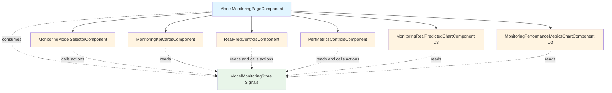
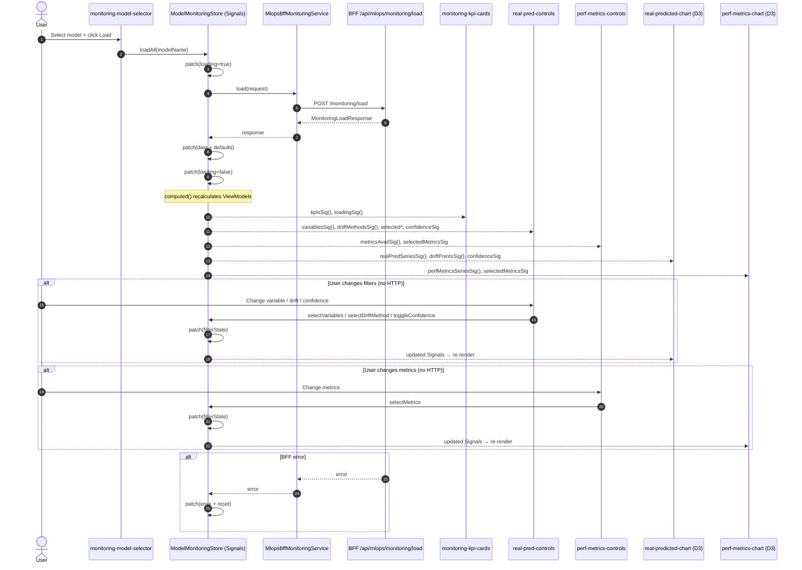
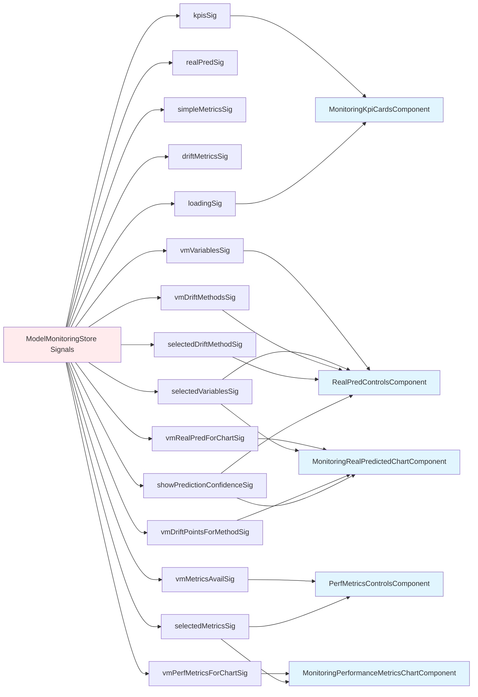
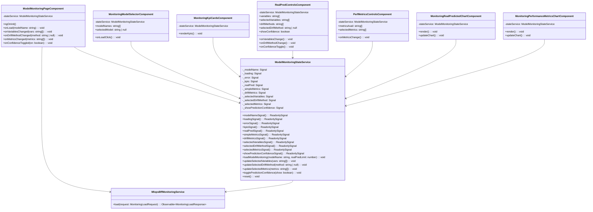

# Model Monitoring — Especificação Angular

---

## 1. Visão Geral

A aba **Model Monitoring** permite acompanhar o desempenho e comportamento de modelos em produção.

Funciona como um painel completo de monitoramento, exibindo:

- KPIs atuais e variação (delta)
- Séries temporais **Real vs Predicted**
- Métricas de performance ao longo do tempo
- Pontos e eventos de **drift**
- Metadados do modelo (target, status de predição, confiança)

### Princípios

- Nenhum cálculo estatístico no Front-End
- Todos os valores são pré-computados no BFF
- Apenas **1 chamada de API** após seleção do modelo
- Estado centralizado via **Angular Signals (Store)**

---

## 2. Requisitos Técnicos

- Angular com **Signals**
- D3.js para gráficos
- Nenhuma agregação/reprocessamento no FE
- Comunicação somente com o **BFF** para dados de monitoramento
### Endpoints

#### MLflow (lista de modelos)

- GET /api/2.0/mlflow/registered-models/search

#### BFF Monitoring

- POST /api/mlops/monitoring/load

---

## 3. Arquitetura de Componentes



### Observações

- Nenhum componente mantém estado de negócio.
- Nenhum componente faz chamadas HTTP.
- Toda reatividade vem do **Store via Signals**.

---

## 4. Fluxo de Dados (Sequence)


## 5. Detalhamento dos Componentes (Padrão Signals)

### Regras Gerais

- Dados entram como **Signal Inputs**
- Interações chamam **ações do Store**
- Sem @Output() / EventEmitter

---

### 5.1 ModelMonitoringPageComponent

#### Responsabilidades

- Injetar o Store
- Expor Signals e actions no template

#### Signals expostos

- vmKpisSig
- vmVariablesSig
- vmSelectedVariablesSig
- vmDriftMethodsSig
- vmSelectedDriftMethodSig
- vmMetricsAvailSig
- vmSelectedMetricsSig
- vmRealPredForChartSig
- vmDriftPointsForMethodSig
- vmPerfMetricsForChartSig
- loadingSig

#### Actions

- loadAll(modelName)
- selectVariables(vars)
- selectDriftMethod(method)
- selectMetrics(metrics)
- toggleConfidence(on)

---

### 5.2 MonitoringModelSelectorComponent

#### Signals

- modelNamesSig
- loadingSig

#### Actions

- loadAll(modelName)

---

### 5.3 MonitoringKpiCardsComponent

#### Signals

- kpisSig
- loadingSig

---

### 5.4 RealPredControlsComponent

#### Signals

- variablesSig
- selectedVariablesSig
- driftMethodsSig
- selectedDriftMethodSig
- showConfidenceSig
#### Actions

- selectVariables(vars)
- selectDriftMethod(method)
- toggleConfidence(on)

---

### 5.5 PerfMetricsControlsComponent

#### Signals

- metricsAvailSig
- selectedMetricsSig

#### Actions

- selectMetrics(metrics)

---

### 5.6 MonitoringRealPredictedChartComponent (D3)

#### Signals

- seriesSig
- selectedVariablesSig
- driftPointsForMethodSig
- showConfidenceSig

---

### 5.7 MonitoringPerformanceMetricsChartComponent (D3)

#### Signals

- metricsSeriesSig
- selectedMetricsSig

---

## 6. Estrutura de Signals (Store)



---

## 7. Interfaces / Models

Local: @interfaces/model-monitoring/

_(mantém exatamente os contratos definidos pelo BFF)_

### MonitoringLoadRequest

```
export interface MonitoringLoadRequest { 
	modelName: string; 
	limits?: { 
		realPred?: number; 
	}; 
}
```

### MonitoringLoadResponse

```
export interface MonitoringLoadResponse { 
	modelName: string; 
	modelTarget: string; 
	kpis: MonitoringKpisDto; 
	realPred: RealPredSeriesDto; 
	simpleMetrics: SimpleMetricsSeriesDto; 
	driftMetrics?: DriftMetricsSeriesDto; 
}
```

_(demais DTOs: KPIs, RealPred, SimpleMetrics, Drift — conforme contrato do BFF)_

---

## 8. Serviço de API (BFF)

Arquivo: mlops-bff-monitoring.service.ts

```
load(request: MonitoringLoadRequest): Observable<MonitoringLoadResponse>;
````
### Responsabilidades

- Encaminhar request ao BFF
- Normalizar timestamps se necessário
- Não recomputar métricas

---

## 9. Estrutura de Pastas

```
src/app/
  @components/
    @charts/
      model-monitoring/
        monitoring-real-predicted/
          monitoring-real-predicted-chart.component.ts|html|scss
        monitoring-performance-metrics/
          monitoring-performance-metrics-chart.component.ts|html|scss
  @interfaces/
    model-monitoring/
      monitoring-load.request.ts
      monitoring-load.response.ts
      monitoring-kpis.dto.ts
      monitoring-drift.dto.ts
      monitoring-real-pred.dto.ts
      monitoring-simple-metrics.dto.ts
  @page/
    governance-group/
      model-monitoring/
        model-monitoring-page.component.ts|html|scss
      monitoring-model-selector/
        monitoring-model-selector.component.ts|html|scss
      monitoring-kpi-cards/
        monitoring-kpi-cards.component.ts|html|scss
      real-pred-controls/
        real-pred-controls.component.ts|html|scss
      perf-metrics-controls/
        perf-metrics-controls.component.ts|html|scss
      store/
        model-monitoring.store.ts
        model-monitoring.state.ts
  @services/
    mlops-bff-monitoring.service.ts
```

---

## 10. Checklist de Implementação

### Serviços

- Interfaces BFF
- Service load()
- Interceptors / timeout

### Store

- State inicial
- Computed por componente
- Defaults após load

### Componentes

- Selector
- KPI Cards
- Controls
- Charts D3
- Page

### UX

- Estados vazios
- Skeleton loading
- Mensagens não bloqueantes

### QA

- Mock BFF
- Filtros sem HTTP
- Stress test D3

---

## 11. Diagrama de Classe




##### AJUSTES
- Adicionar filtros mais complexos para querries de dados (alcance de tempo, variáveis), componente novo.
	- Não presente no streamlit mas será adicionado na versão angular
	- Se o usuário selecionar uma configuração de querry que não retorna nenhum dado, a UI deve expor uma mensagem como "No data found" ou semelhante.
- Estrutura de pastas precisa ser atualizada para formato mais recente
- Verificar nomenclatura das variáveis para manter padrão do projeto
	- Principalmente os sinais e afins (pode ser q n seja necessário)
- Adicionar endpoint de atualização em tempo real de dados (grafana like) 
	- Checar viabilidade
- Skeleton loading não faz sentido por agora, manter spinner overlay (padrão do projeto), deve ser removido do planejamento
- 