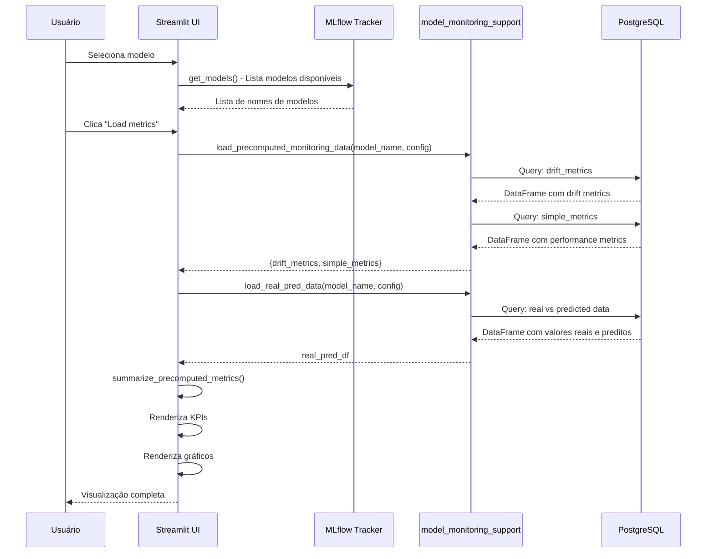
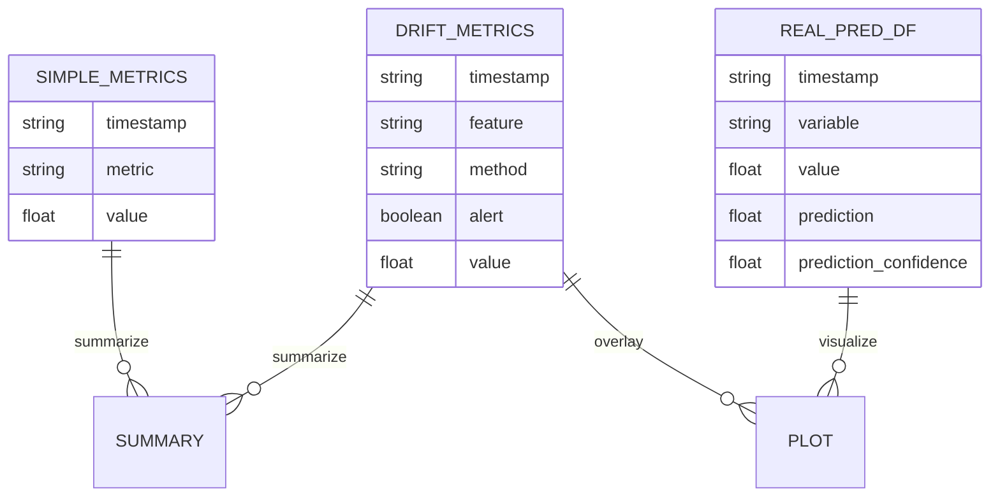
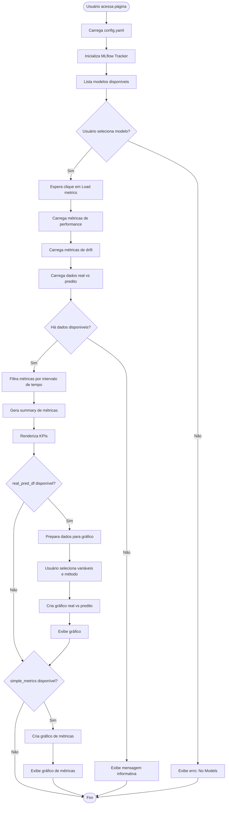

## Visão Geral

  

A página **Model Monitoring** é uma interface Streamlit que permite visualizar e monitorar o desempenho de modelos de machine learning em produção. A página **não calcula métricas ou drift**, apenas lê dados pré-calculados armazenados no PostgreSQL e os apresenta de forma visual.

  

### Princípios de Design

  

```389:399:app/pages/model_monitoring.py

def model_monitoring():

    """SIENTIA Model Monitoring page.

  

    IMPORTANTE:

    - Esta pagina NAO deve calcular metricas ou drift.

    - Responsabilidades desta pagina:

        * Ler metricas/drifts pre-calculados no PostgreSQL via

          ``src.operations.model_monitoring_support``.

        * Aplicar apenas transformacoes tabulares minimas (pivot).

        * Plotar graficos e tabelas.

    """

```

  

**Responsabilidades:**

- ✅ Ler métricas pré-calculadas do PostgreSQL

- ✅ Ler dados de drift pré-calculados

- ✅ Ler dados de valores reais vs preditos

- ✅ Aplicar transformações tabulares mínimas

- ✅ Renderizar gráficos e KPIs

- ❌ **NÃO** calcular métricas

- ❌ **NÃO** calcular drift

  

---

  

## Arquitetura e Fluxo de Dados

  

### Fluxo Principal

  



  

### Estrutura de Dados

  



  

---

  

## Features Principais

  

### 1. Seleção de Modelo

  

A página permite selecionar um modelo do MLflow Tracker para monitorar.

  

```418:429:app/pages/model_monitoring.py

    # Selecao de modelo

    try:

        model_name_real = st.selectbox(

            "Model Name",

            sientia_tracker.get_models()["name"],

            key="model_name_select",

            help="Select the model to monitor",

        )

    except KeyError:

        st.error("No Models")

        st.stop()

```

  

**Funcionamento:**

1. Inicializa o MLflow Tracker usando `config.yaml`

2. Obtém lista de modelos via `sientia_tracker.get_models()["name"]`

3. Exibe selectbox para o usuário escolher o modelo

4. Se não houver modelos, exibe erro e interrompe a execução

  

---

  

### 2. Carregamento de Dados

  

Ao clicar em "Load metrics", a página carrega três tipos de dados:

  

#### 2.1 Métricas de Performance (Simple Metrics)

  

```435:445:app/pages/model_monitoring.py

        # Tenta carregar métricas, mas não impede o carregamento do real vs predito

        try:

            monitoring_data = model_monitoring_support.load_precomputed_monitoring_data(

                model_name_real, config

            )

            st.session_state.simple_metrics = monitoring_data["simple_metrics"]

            st.session_state.drift_metrics = monitoring_data["drift_metrics"]

        except (ValueError, Exception) as e:

            st.warning(f"Could not load monitoring metrics/drift: {e}")

            st.session_state.simple_metrics = None

            st.session_state.drift_metrics = None

```

  

**Estrutura esperada de `simple_metrics`:**

- `timestamp`: Data/hora da métrica

- `metric`: Nome da métrica (RMSE, MAE, MSE, R²)

- `value`: Valor da métrica

  

#### 2.2 Métricas de Drift

  

Carregadas junto com as métricas simples, contêm informações sobre detecção de drift:

  

**Estrutura esperada de `drift_metrics`:**

- `timestamp`: Data/hora do drift detectado

- `feature`: Nome da feature onde o drift foi detectado

- `method`: Método de detecção usado (ex: "kolmogorov_smirnov")

- `alert`: Boolean indicando se é um alerta

- `value`: Valor do drift

  

#### 2.3 Dados Real vs Predito

  

```447:459:app/pages/model_monitoring.py

        # Carrega dados real vs predito (independente das métricas)

        try:

            load_real_pred = getattr(

                model_monitoring_support, "load_real_pred_data", None

            )

            if load_real_pred is None:

                raise ImportError(

                    "Função `load_real_pred_data` não encontrada em `src.operations.model_monitoring_support`."

                )

            st.session_state.real_pred_df = load_real_pred(model_name_real, config)

        except Exception as e:

            st.warning(f"Could not load real vs predicted data: {e}")

            st.session_state.real_pred_df = None

```

  

**Estrutura esperada de `real_pred_df`:**

- `timestamp`: Data/hora da predição

- `variable`: Nome da variável (target tem sufixo "(target)")

- `value`: Valor real observado

- `prediction`: Valor predito pelo modelo

- `prediction_confidence`: Confiança da predição (0 = boa, >0 = ruim)

  

**Nota Importante:** O carregamento de `real_pred_df` é **independente** das métricas. Mesmo se as métricas falharem, os dados de real vs predito ainda podem ser carregados.

  

---

  

### 3. Filtragem de Métricas por Intervalo de Tempo

  

As métricas são filtradas para corresponder ao intervalo de tempo dos dados de real vs predito:

  

```481:492:app/pages/model_monitoring.py

    # Filtra métricas pelo intervalo de tempo do real_pred_df (se disponível)

    if (

        real_pred_df is not None

        and not real_pred_df.empty

        and "timestamp" in real_pred_df.columns

        and (simple_metrics is not None or drift_metrics is not None)

    ):

        min_date = real_pred_df["timestamp"].min()

        max_date = real_pred_df["timestamp"].max()

        drift_metrics, simple_metrics = _filter_metrics_by_time_range(

            drift_metrics, simple_metrics, min_date, max_date

        )

```

  

A função `_filter_metrics_by_time_range` implementa a lógica de filtragem:

  

```38:62:app/pages/model_monitoring.py

def _filter_metrics_by_time_range(

    drift_metrics: Optional[pd.DataFrame],

    simple_metrics: Optional[pd.DataFrame],

    min_date: pd.Timestamp,

    max_date: pd.Timestamp,

) -> Tuple[pd.DataFrame, pd.DataFrame]:

    """Filtra métricas pelo intervalo de tempo do real_pred_df."""

    if drift_metrics is None or drift_metrics.empty:

        drift_filtered = pd.DataFrame()

    else:

        drift_filtered = drift_metrics[

            (drift_metrics["timestamp"] >= min_date)

            & (drift_metrics["timestamp"] <= max_date)

            & (drift_metrics["alert"].astype(bool))

        ].copy()

  

    if simple_metrics is None or simple_metrics.empty:

        simple_filtered = pd.DataFrame()

    else:

        simple_filtered = simple_metrics[

            (simple_metrics["timestamp"] >= min_date)

            & (simple_metrics["timestamp"] <= max_date)

        ].copy()

  

    return drift_filtered, simple_filtered

```

  

**Comportamento:**

- **Drift metrics**: Filtra por intervalo de tempo **E** apenas registros com `alert=True`

- **Simple metrics**: Filtra apenas por intervalo de tempo

- Se não houver `real_pred_df`, filtra apenas drift com `alert=True`

  

---

  

### 4. KPIs Principais

  

A página exibe 4 colunas de KPIs principais:

  

```65:153:app/pages/model_monitoring.py

def _render_kpi_metrics(summary: dict, real_pred_df: Optional[pd.DataFrame]) -> None:

    """Renderiza os KPIs principais na interface."""

    kpi_cols = st.columns((1, 1, 1, 1))

  

    with kpi_cols[0]:

        if summary.get("rmse_now") is not None:

            st.metric(

                label="RMSE",

                value=f"{summary.get('rmse_now')}",

                delta=summary.get("rmse_delta"),

                delta_color="inverse",

                help="Root Mean Squared Error — measures the average magnitude of the error. Lower is better.",

            )

        else:

            st.info("RMSE not available")

  

        if summary.get("mse_now") is not None:

            st.metric(

                label="MSE",

                value=f"{summary.get('mse_now')}",

                delta=summary.get("mse_delta"),

                delta_color="inverse",

                help="Mean Squared Error — average of the squared differences between predicted and actual values. Lower is better.",

            )

        else:

            st.info("MSE not available")

  

    with kpi_cols[1]:

        if summary.get("mae_now") is not None:

            st.metric(

                label="MAE",

                value=f"{summary.get('mae_now')}",

                delta=summary.get("mae_delta"),

                delta_color="inverse",

                help="Mean Absolute Error — average of absolute differences between predictions and actual values. Lower is better.",

            )

        else:

            st.info("MAE not available")

  

        if summary.get("r2_now") is not None:

            st.metric(

                label="R2",

                value=f"{summary.get('r2_now')}",

                delta=summary.get("r2_delta"),

                delta_color="normal",

                help="Coefficient of Determination (R²) — measures how well predictions approximate the actual data. Higher is better (up to 1.0).",

            )

        else:

            st.info("R2 not available")

  

    with kpi_cols[2]:

        if summary.get("drift_alerts_count") is not None:

            last_alert = summary.get("last_drift_alert_ts")

            st.metric(

                label="Drift Alerts",

                value=f"{summary.get('drift_alerts_count')} alerts",

                delta=last_alert.strftime("%Y-%m-%d %H:%M:%S")

                if last_alert is not None

                else None,

                delta_color="inverse"

                if (summary.get("drift_alerts_count") or 0) > 0

                else "off",

                help="Number of detected data drift alerts and timestamp of the last alert. A higher number indicates more drift events.",

            )

        else:

            st.info("No drift data")

  

    with kpi_cols[3]:

        if real_pred_df is None or getattr(real_pred_df, "empty", True):

            st.info("No prediction data")

        else:

            status, confidence = (

                model_monitoring_support.get_pred_status_and_confidence(real_pred_df)

            )

            display_status = "Good" if confidence == 0 else "Bad"

            st.metric(

                label="Prediction Status",

                value=display_status,

                help="Último status de predição por timestamp. Se prediction confidence == 0, status é 'Good'.",

            )

            if confidence is not None:

                st.metric(

                    label="Prediction Confidence",

                    value=str(int(confidence)),

                    help="Última confiança de predição por timestamp.",

                )

            else:

                st.info("Prediction confidence not available")

```

  

**Coluna 1: RMSE e MSE**

- **RMSE** (Root Mean Squared Error): Mede a magnitude média do erro

- **MSE** (Mean Squared Error): Média dos erros ao quadrado

- Ambos usam `delta_color="inverse"` (vermelho = pior, verde = melhor)

  

**Coluna 2: MAE e R²**

- **MAE** (Mean Absolute Error): Média dos erros absolutos

- **R²** (Coefficient of Determination): Quão bem as predições se aproximam dos dados reais

- R² usa `delta_color="normal"` (verde = melhor, vermelho = pior)

  

**Coluna 3: Drift Alerts**

- Contagem de alertas de drift detectados

- Timestamp do último alerta no campo `delta`

- Cor inversa: vermelho se houver alertas

  

**Coluna 4: Prediction Status e Confidence**

- **Status**: "Good" se `confidence == 0`, "Bad" caso contrário

- **Confidence**: Último valor de confiança da predição

- Calculado via `model_monitoring_support.get_pred_status_and_confidence()`

  

**Geração do Summary:**

  

```501:514:app/pages/model_monitoring.py

    # KPIs Principais (apenas se houver métricas)

    if simple_metrics is not None or drift_metrics is not None:

        try:

            summary = model_monitoring_support.summarize_precomputed_metrics(

                simple_metrics, drift_metrics

            )

            _render_kpi_metrics(summary, real_pred_df)

        except Exception as e:

            st.warning(f"Could not summarize metrics: {e}")

    else:

        # Renderiza apenas KPIs do real_pred_df se disponível

        if real_pred_df is not None and not real_pred_df.empty:

            summary = {}

            _render_kpi_metrics(summary, real_pred_df)

```

  

---

  

### 5. Gráfico Real vs Predito

  

O gráfico principal mostra valores reais, preditos, e pontos de drift ao longo do tempo.

  

#### 5.1 Preparação dos Dados

  

```517:536:app/pages/model_monitoring.py

    # Real vs Predito

    if "real_pred_df" in st.session_state and st.session_state.real_pred_df is not None:

        st.subheader("Real vs Predicted Values")

  

        real_pred_df = st.session_state.real_pred_df.copy()

  

        if not real_pred_df.empty:

            # Prepara dados para o gráfico

            required_cols = [

                "timestamp",

                "variable",

                "value",

                "prediction",

                "prediction_confidence",

            ]

            if not all(col in real_pred_df.columns for col in required_cols):

                st.warning("Missing required columns in real vs predicted data.")

            else:

                plot_df = real_pred_df[required_cols].copy()

                plot_df = plot_df.sort_values("timestamp")

```

  

#### 5.2 Seleção de Variáveis e Método de Drift

  

```538:569:app/pages/model_monitoring.py

                # Variáveis e métodos disponíveis

                variables = sorted(plot_df["variable"].unique())

                # Tenta obter métodos de drift (se disponível)

                drift_methods = []

                if drift_metrics is not None and not drift_metrics.empty:

                    try:

                        drift_methods = sorted(drift_metrics["method"].unique())

                    except (KeyError, AttributeError):

                        drift_methods = []

  

                cols = st.columns((1, 1))

                selected_vars = cols[0].multiselect(

                    "Select variables to plot",

                    options=variables,

                    default=variables[:1] if variables else [],

                )

  

                selected_method = None

                if drift_methods:

                    default_method = (

                        "kolmogorov_smirnov"

                        if "kolmogorov_smirnov" in drift_methods

                        else drift_methods[0]

                    )

                    selected_method = cols[1].selectbox(

                        "Select method to plot",

                        options=drift_methods,

                        index=drift_methods.index(default_method),

                    )

                else:

                    cols[1].info("No drift methods available")

```

  

**Interface:**

- **Multiselect** para escolher variáveis a plotar

- **Selectbox** para escolher método de drift (se disponível)

- Padrão: primeira variável e "kolmogorov_smirnov" (se disponível)

  

#### 5.3 Opção de Mostrar Confiança

  

```571:571:app/pages/model_monitoring.py

                show_confidence = st.checkbox("Show prediction confidence", value=False)

```

  

#### 5.4 Criação do Gráfico

  

A função `_create_real_pred_plot` cria o gráfico Plotly:

  

```223:329:app/pages/model_monitoring.py

def _create_real_pred_plot(

    plot_df: pd.DataFrame,

    drift_metrics: Optional[pd.DataFrame],

    selected_vars: List[str],

    selected_method: Optional[str],

    show_confidence: bool,

) -> go.Figure:

    """Cria gráfico de valores reais vs preditos com pontos de drift."""

    fig = go.Figure()

  

    if not selected_vars:

        return fig

  

    var_df = plot_df[plot_df["variable"].isin(selected_vars)].copy()

  

    # Prepara drift points uma única vez (se disponível)

    drift_points = pd.DataFrame()

    if drift_metrics is not None and not drift_metrics.empty and selected_method:

        try:

            drift_points = drift_metrics[drift_metrics["method"] == selected_method].copy()

            drift_points = drift_points.sort_values("timestamp").drop_duplicates(

                "timestamp", keep="first"

            )

        except (KeyError, AttributeError):

            drift_points = pd.DataFrame()

  

    # Busca variável target

    target_var, target_df = _get_target_variable(plot_df)

    mean_value = var_df["value"].mean() if not var_df.empty else 0.0

  

    # Adiciona pontos de drift (otimizado)

    if not drift_points.empty:

        drift_with_y = _get_drift_y_values(drift_points, target_df, mean_value)

  

        for feature in drift_with_y["feature"].unique():

            feature_data = drift_with_y[drift_with_y["feature"] == feature]

            fig.add_trace(

                go.Scatter(

                    x=feature_data["timestamp"],

                    y=feature_data["y_value"],

                    mode="markers",

                    name=f"Drift ({feature})",

                    marker=dict(

                        color=MODEL_DRIFT_COLOR

                        if "(target)" in str(feature)

                        else DATA_DRIFT_COLOR,

                        size=10,

                    ),

                )

            )

  

    # Adiciona variáveis selecionadas

    for var in selected_vars:

        var_data = var_df[var_df["variable"] == var]

        fig.add_trace(

            go.Scatter(

                x=var_data["timestamp"],

                y=var_data["value"],

                mode="lines",

                name=var,

                line=dict(color=REAL_DATA_COLOR),

            )

        )

  

    # Adiciona predição (uma única vez, sem duplicatas)

    pred_data = plot_df.drop_duplicates("timestamp", keep="first")

    fig.add_trace(

        go.Scatter(

            x=pred_data["timestamp"],

            y=pred_data["prediction"],

            mode="lines",

            name="prediction",

            line=dict(dash="dash", color=PREDICTION_COLOR),

        )

    )

  

    # Adiciona confidence se solicitado

    if show_confidence:

        conf_data = pred_data.copy()

        fig.add_trace(

            go.Scatter(

                x=conf_data["timestamp"],

                y=conf_data["prediction_confidence"],

                mode="lines",

                name="Prediction confidence",

                line=dict(dash="dot"),

                yaxis="y2",

            )

        )

  

    # Layout

    layout_dict = {

        "title": "Variables and Prediction Confidence Over Time",

        "xaxis_title": "Timestamp",

        "yaxis_title": "Variable value",

        "legend_title": "Series",

    }

    if show_confidence:

        layout_dict["yaxis2"] = dict(

            title="Prediction confidence",

            overlaying="y",

            side="right",

            showgrid=False,

        )

    fig.update_layout(**layout_dict)

  

    return fig

```

  

**Elementos do Gráfico:**

  

1. **Pontos de Drift** (markers):

   - Cor laranja (`MODEL_DRIFT_COLOR`) se for drift no target

   - Cor vermelha (`DATA_DRIFT_COLOR`) se for drift em features

   - Posicionados no valor Y correspondente ao timestamp mais próximo

  

2. **Variáveis Reais** (linhas sólidas):

   - Cor azul (`REAL_DATA_COLOR`)

   - Uma linha por variável selecionada

  

3. **Predições** (linha tracejada):

   - Cor verde (`PREDICTION_COLOR`)

   - Linha tracejada (`dash="dash"`)

  

4. **Confiança da Predição** (opcional, linha pontilhada):

   - Eixo Y secundário (lado direito)

   - Linha pontilhada (`dash="dot"`)

  

#### 5.5 Cálculo de Valores Y para Drift

  

A função `_get_drift_y_values` encontra o valor Y mais próximo para cada ponto de drift:

  

```167:220:app/pages/model_monitoring.py

def _get_drift_y_values(

    drift_points: pd.DataFrame,

    target_df: pd.DataFrame,

    mean_value: float,

) -> pd.DataFrame:

    """Obtém valores Y para pontos de drift usando merge_asof (otimizado)."""

    if drift_points.empty:

        return pd.DataFrame()

  

    if target_df.empty:

        result = drift_points.copy()

        result["y_value"] = mean_value

        return result

  

    # Prepara DataFrames ordenados

    target_sorted = target_df[["timestamp", "value"]].sort_values("timestamp").copy()

    drift_sorted = drift_points.sort_values("timestamp").copy()

  

    try:

        # Tenta usar merge_asof (mais eficiente, disponível no pandas >= 0.19.0)

        merged = pd.merge_asof(

            drift_sorted[["timestamp", "feature"]],

            target_sorted,

            on="timestamp",

            direction="nearest",

            tolerance=pd.Timedelta(days=1),

        )

        merged["y_value"] = merged["value"].fillna(mean_value)

        result = drift_sorted.merge(

            merged[["timestamp", "feature", "y_value"]],

            on=["timestamp", "feature"],

            how="left",

        )

        result["y_value"] = result["y_value"].fillna(mean_value)

    except (AttributeError, TypeError):

        # Fallback para versões antigas do pandas: usa busca vetorizada

        target_timestamps = target_sorted["timestamp"].values

        target_values = target_sorted["value"].values

        drift_timestamps = drift_sorted["timestamp"].values

  

        # Calcula diferenças para todos os timestamps de uma vez (vetorizado)

        y_values = []

        for ts in drift_timestamps:

            diffs = abs(target_timestamps - ts)

            closest_idx = diffs.argmin()

            if diffs[closest_idx] > pd.Timedelta(days=1):

                y_values.append(mean_value)

            else:

                y_values.append(target_values[closest_idx])

  

        result = drift_sorted.copy()

        result["y_value"] = y_values

  

    return result

```

  

**Algoritmo:**

1. Tenta usar `pd.merge_asof()` (mais eficiente) com tolerância de 1 dia

2. Se falhar, usa busca vetorizada manual

3. Se não encontrar valor dentro da tolerância, usa `mean_value`

  

#### 5.6 Identificação da Variável Target

  

```155:164:app/pages/model_monitoring.py

def _get_target_variable(plot_df: pd.DataFrame) -> Tuple[Optional[str], pd.DataFrame]:

    """Busca a variável target que contém '(target)' no nome."""

    target_var = next(

        (v for v in plot_df["variable"].unique() if "(target)" in str(v)), None

    )

    if target_var is not None:

        target_df = plot_df[plot_df["variable"] == target_var].copy()

    else:

        target_df = pd.DataFrame()

    return target_var, target_df

```

  

A variável target é identificada pelo sufixo `"(target)"` no nome.

  

---

  

### 6. Gráfico de Métricas de Performance ao Longo do Tempo

  

Exibe métricas de performance (RMSE, MAE, MSE, R²) como séries temporais:

  

```332:386:app/pages/model_monitoring.py

def _create_metrics_plot(simple_metrics: pd.DataFrame) -> None:

    """Cria gráfico de métricas de performance ao longo do tempo."""

    if simple_metrics is None or simple_metrics.empty:

        st.warning("No performance metrics available for the selected model.")

        return

  

    required_cols = {"metric", "value", "timestamp"}

    if not required_cols <= set(simple_metrics.columns):

        st.warning("No performance metrics available for the selected model.")

        return

  

    sm_df = simple_metrics.copy()

    sm_df["timestamp"] = pd.to_datetime(sm_df["timestamp"])

    sm_df = sm_df.sort_values("timestamp")

    sm_df["metric_plot"] = sm_df["metric"].astype(str).str.upper()

  

    metrics_available = sorted(sm_df["metric_plot"].unique())

    selected_metrics = st.multiselect(

        "Select metrics to plot",

        options=metrics_available,

        default=metrics_available,

    )

  

    if not selected_metrics:

        st.info("Select at least one metric to plot.")

        return

  

    plot_df = sm_df[sm_df["metric_plot"].isin(selected_metrics)]

    theme_metric_colors = {

        "RMSE": REAL_DATA_COLOR,

        "MAE": PREDICTION_COLOR,

        "MSE": MODEL_DRIFT_COLOR,

        "R2": DATA_DRIFT_COLOR,

    }

  

    fig = px.line(

        plot_df,

        x="timestamp",

        y="value",

        color="metric_plot",

        markers=False,

        color_discrete_map=theme_metric_colors,

        color_discrete_sequence=[

            REAL_DATA_COLOR,

            PREDICTION_COLOR,

            MODEL_DRIFT_COLOR,

            DATA_DRIFT_COLOR,

        ],

        labels={"value": "Metric value", "metric_plot": "Metric"},

    )

    fig.update_layout(

        xaxis_title="Time",

        yaxis_title="Value",

    )

    st.plotly_chart(fig, use_container_width=True)

```

  

**Funcionalidades:**

- **Multiselect** para escolher quais métricas plotar

- **Cores temáticas** por tipo de métrica:

  - RMSE: Azul (`REAL_DATA_COLOR`)

  - MAE: Verde (`PREDICTION_COLOR`)

  - MSE: Laranja (`MODEL_DRIFT_COLOR`)

  - R²: Vermelho (`DATA_DRIFT_COLOR`)

- Gráfico de linhas Plotly Express

- Ordenação por timestamp

  

**Renderização:**

  

```588:592:app/pages/model_monitoring.py

    # Métricas no tempo (apenas se disponível)

    if simple_metrics is not None:

        st.subheader("Performance metrics over time")

        _create_metrics_plot(simple_metrics)

        st.divider()

```

  

---

  

## Tema e Cores

  

A página usa um esquema de cores consistente:

  

```23:29:app/pages/model_monitoring.py

# ------------------------------------------------------------------

# Tema (cores)

# ------------------------------------------------------------------

REAL_DATA_COLOR = "#4C74ED"

PREDICTION_COLOR = "#31985F"

MODEL_DRIFT_COLOR = "#FF7D00"

DATA_DRIFT_COLOR = "#FF003C"

```

  

**Paleta:**

- **Azul** (`#4C74ED`): Dados reais

- **Verde** (`#31985F`): Predições

- **Laranja** (`#FF7D00`): Drift no modelo/target

- **Vermelho** (`#FF003C`): Drift em features de dados

  

---

  

## Tratamento de Erros e Estados Vazios

  

A página implementa tratamento robusto de erros:

  

### 1. Carregamento de Dados

  

```442:459:app/pages/model_monitoring.py

        except (ValueError, Exception) as e:

            st.warning(f"Could not load monitoring metrics/drift: {e}")

            st.session_state.simple_metrics = None

            st.session_state.drift_metrics = None

  

        # Carrega dados real vs predito (independente das métricas)

        try:

            load_real_pred = getattr(

                model_monitoring_support, "load_real_pred_data", None

            )

            if load_real_pred is None:

                raise ImportError(

                    "Função `load_real_pred_data` não encontrada em `src.operations.model_monitoring_support`."

                )

            st.session_state.real_pred_df = load_real_pred(model_name_real, config)

        except Exception as e:

            st.warning(f"Could not load real vs predicted data: {e}")

            st.session_state.real_pred_df = None

```

  

**Estratégia:**

- Cada tipo de dado é carregado independentemente

- Erros não impedem o carregamento de outros dados

- Mensagens de warning informam o usuário

  

### 2. Verificação de Dados Disponíveis

  

```461:475:app/pages/model_monitoring.py

    # Verifica se há dados para exibir (métricas OU real vs predito)

    has_metrics = (

        "simple_metrics" in st.session_state

        and st.session_state.simple_metrics is not None

    )

    has_real_pred = (

        "real_pred_df" in st.session_state

        and st.session_state.real_pred_df is not None

        and hasattr(st.session_state.real_pred_df, "empty")

        and not st.session_state.real_pred_df.empty

    )

  

    if not has_metrics and not has_real_pred:

        st.info("Select a model and click 'Load metrics' to visualize monitoring data.")

        return

```

  

**Lógica:**

- Verifica se há métricas **OU** dados de real vs predito

- Se nenhum estiver disponível, exibe mensagem informativa e retorna

- Permite visualização parcial se apenas um tipo de dado estiver disponível

  

### 3. Validação de Colunas

  

```532:533:app/pages/model_monitoring.py

            if not all(col in real_pred_df.columns for col in required_cols):

                st.warning("Missing required columns in real vs predicted data.")

```

  

### 4. Tratamento de Exceções em KPIs

  

```502:509:app/pages/model_monitoring.py

    # KPIs Principais (apenas se houver métricas)

    if simple_metrics is not None or drift_metrics is not None:

        try:

            summary = model_monitoring_support.summarize_precomputed_metrics(

                simple_metrics, drift_metrics

            )

            _render_kpi_metrics(summary, real_pred_df)

        except Exception as e:

            st.warning(f"Could not summarize metrics: {e}")

```

  

---

  

## Fluxo de Execução Completo

  



  

---

  

## Dependências e Módulos

  

### Módulos Principais

  

1. **`streamlit`**: Framework de UI

2. **`sientia.ModelServing`**: MLflow Tracker

3. **`pandas`**: Manipulação de dados

4. **`plotly.express`** e **`plotly.graph_objects`**: Visualização

5. **`src.operations.model_monitoring_support`**: Módulo de suporte para carregamento de dados

  

### Funções do Módulo de Suporte

  

- `load_precomputed_monitoring_data()`: Carrega métricas e drift do PostgreSQL

- `load_real_pred_data()`: Carrega dados de real vs predito

- `summarize_precomputed_metrics()`: Gera summary de métricas

- `get_pred_status_and_confidence()`: Obtém status e confiança da predição

  

---

  

## Considerações de Performance

  

### Otimizações Implementadas

  

1. **`merge_asof` para Drift Points**: Usa operação otimizada do pandas para encontrar valores Y mais próximos

2. **Fallback Vetorizado**: Se `merge_asof` não estiver disponível, usa busca vetorizada manual

3. **Drop Duplicates**: Remove duplicatas antes de plotar predições

4. **Filtragem Prévia**: Filtra métricas antes de processar

  

### Limitações

  

- Dados de real vs predito têm limite padrão de 5000 registros (configurável via `limit` em `load_real_pred_data`)

- Processamento de drift points pode ser lento com muitos pontos

  

---

  

## Resumo das Features

  

| Feature | Descrição | Dados Necessários |

|---------|-----------|-------------------|

| **Seleção de Modelo** | Lista modelos do MLflow | MLflow Tracker |

| **KPIs de Performance** | RMSE, MSE, MAE, R² com deltas | `simple_metrics` |

| **KPIs de Drift** | Contagem de alertas e último alerta | `drift_metrics` |

| **KPIs de Predição** | Status e confiança da predição | `real_pred_df` |

| **Gráfico Real vs Predito** | Valores reais, preditos, e drift | `real_pred_df`, `drift_metrics` (opcional) |

| **Gráfico de Métricas** | Séries temporais de métricas | `simple_metrics` |

| **Filtragem Temporal** | Filtra métricas por intervalo | `real_pred_df` + métricas |

  

---

  

## Conclusão

  

A página **Model Monitoring** é uma interface de visualização que:

  

- ✅ **Lê** dados pré-calculados do PostgreSQL

- ✅ **Filtra** e **transforma** dados minimamente

- ✅ **Visualiza** métricas, drift e predições

- ✅ **Trata erros** graciosamente

- ❌ **NÃO calcula** métricas ou drift (responsabilidade de outros módulos)

  

A arquitetura separa claramente as responsabilidades: cálculo de métricas/drift é feito em processos separados, enquanto esta página apenas apresenta os resultados de forma visual e interativa.